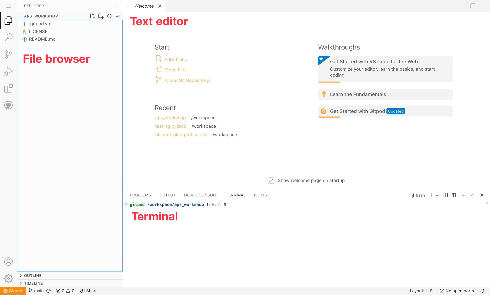

# PathogenSurveillance Workshop

This session is part of [**Nanopore Sequencing and Whole Genome Assembly and Annotation with nf-core/pathogensurveillance**](https://events.rdmobile.com/Sessions/Details/2316143)

---

## Table of Contents

1. [Resources](#resources)
2. [Prerequisites](#prerequisites)
3. [Setting up Gitpod](#setting-up-gitpod)
X. [Session Leader(s) Bios](#session-leaders-bios)
---

## Resources

- [PathogenSurveillance Repository](https://github.com/grunwaldlab/pathogensurveillance)
- [PSMiner Repository](https://github.com/grunwaldlab/psminer)

---

## Prerequisites

- **Some familiarity with the Linux command-line interface**  
  If not, look here for resources:
  - [Command Line and Filesystem](https://open.oregonstate.education/computationalbiology/chapter/the-command-line-and-filesystem/)
  - [PCfB Appendices](content/PCfB_Appendices.pdf)

- **GitHub account**  
  If you don't have one, please create an account at [GitHub](https://github.com):
  - [Creating an Account on GitHub](https://docs.github.com/en/get-started/start-your-journey/creating-an-account-on-github)

- **Understanding of genomic terms**:
  - Reads
  - Genome
  - Populations
  - Contigs
  - Annotations
  - Phylogenies
  - Variants/SNPs
  - Homology

- **Understanding of the need for bioinformatics workflows**

- **Understanding the general role and input/output files**

---

## Setting up Gitpod

### What is Gitpod?

We are using *Gitpod* to provide hands-on experience with installing and using the pathogen surveillance pipeline we developed. [**Gitpod**](https://gitpod.io/) allows you to launch and enter Virtual Machines from your browser and gives you 50 free hours per calendar month, enough for this session.

### How do I sign up for Gitpod?

You MUST do the following steps before the workshop starts! It will take a few minutes to set up a **GitHub** account and a **Gitpod** account if you don't already have them:

### 1. **Step 00**  
   Click on [this link](https://gitpod.io/new#https://github.com/grunwaldlab/aps_workshop) in any desktop web browser (**Note: Safari sometimes has problems on a Mac, so use Chrome or Mozilla instead)**  
   

### 2. **Step 01**  
   It will ask you to sign up with a GitHub account. If you don't have one, please create an account at [GitHub](https://github.com).  
   

### 3. **Step 02**  
   Once you are signed in to GitHub, click on the Gitpod link above again. It will try to launch our Gitpod workspace using your GitHub login. You will need to give Gitpod permission to access (only) the email address on your GitHub account. Follow the Gitpod prompts to ensure you are a real human and won't misuse their resources. **Note: if it asks you to connect your LinkedIn, you can skip that - you will still get 50 hours :-)**

### 4. **Step 03**  
   Gitpod will ask you to select which code editor and which machine size to start. The defaults are fine. So just click **Continue**  
   

### 5. **Step 04**  
   Once the Gitpod workspace starts (typically in less than a minute), you will see the following in your desktop web browser: a file browser on your left, a text editor top right, and a Linux terminal bottom right.  
   

> *If you are doing this before the workshop, please go to [gitpod.io/workspaces](https://gitpod.io/workspaces) to delete any running workspaces (in green) so that you don't use up your 50 hours per month* 🙂

---

# Exploring PathogenSurveillance Outputs

This document will guide you through the key output directories generated by the `PathogenSurveillance` pipeline. You will learn where to find the outputs and understand their significance.

## `sendsketch`

The `sendsketch` process in the PathogenSurveillance pipeline utilizes the BBMap tool to generate sketch data for the input sequences. This step is crucial for identifying and comparing genomic sequences against a reference database.

### Key output directory: `output/bbmap_sendsketch/`

This directory contains symbolic links to the actual output files generated by the `sendsketch` process. The outputs are stored in the working directory under a unique identifier.

```sh
# Let's list the output for sendsketch:
ll output/bbmap_sendsketch/

# Take a look at output for the sample we included here:
head output/bbmap_sendsketch/*.txt
```

<details>
<summary> 💡 Learn more here </summary>

  ### Inputs
  
  - **Input Sequences**: The process takes in sequencing data files, such as FASTQ files.
  - **Reference Database**: The sequences are compared against a reference database (e.g., RefSeq).
  
  ### Outputs
  
  - **Sketch Files**: These are the primary outputs containing information about the query sequences and their comparison to the reference database.
  
  ### Understanding the Outputs
  
  The main output file `22_323.txt` contains detailed information about the query sequence and its comparison to the reference database. Here are some key fields:
  
  - **Query**: Information about the query sequence, including its ID, run ID, sample ID, and other metadata.
  - **DB**: The reference database used for comparison (e.g., RefSeq).
  - **SketchLen**: The length of the sketch.
  - **Seqs**: Number of sequences in the sketch.
  - **Bases**: Total bases in the sketch.
  - **Quality**: Quality score of the sketch.
  - **Depth**: Depth of the sketch.
  - **Taxonomy**: Taxonomic classification of the sequences.
  
  ### Example Output Snippet
  
  ```
  Query: a4d92ba2-9c26-4548-927d-f10ab976c5fb runid=e8007fcc5055076f3e399f09a077cc1f37b2b8ff sampleid=run4 read=2240 ch=338 start_time=2022-08-04T04:43:00Z model_version_id=2021-11-17_dna_r10.4_minion_promethion_1024_67af0493 barcode=barcode07       DB: RefSeq      SketchLen: 35910   Seqs: 7396      Bases: 88561804 gSize: 5424369  GC: 0.640       Quality: 0.7925 AvgCount: 13.456        Depth: 13.456   File: xan_22-323_nanopore.fastq.gz
  WKID    KID     ANI     SSU     SSULen  Complt  Contam  Contam2 uContam Score   E-Val   Depth   Depth2  Volume  RefHits Matches Unique  Unique2 Unique3 noHit   Length  TaxID   ImgID           gBases  gKmers  gSize   gSeqs   GC      rDiv    qDiv    rSize   qSize   cHits      taxName file    seqName taxonomy
  35.22%  22.41%  96.29%  91.52%  1551    100.00% 20.06%  0.62%   4.03%   6793    0.00e+00        14.05   13.78   113.1   34.20   8047    542     6660    13153   9654    35910   863365  -1      5052399 5014802 4995825 1       0.638   22845   35910   22845   35910   7205       Xanthomonas hortorum pv. carotae str. M081      .       tid|863365|NZ_CM002307.1 Xanthomonas hortorum pv. carotae str. M081 chromosome, whole genome shotgun sequence   sk:Bacteria;p:Proteobacteria;c:Gammaproteobacteria;o:Xanthomonadales;f:Xanthomonadaceae;g:Xanthomonas;s:Xanthomonas hortorum;Xanthomonas hortorum pv. carotae
  ```
 
  ### Column Details
  
  - **WKID**: Weighted K-mer ID, representing the percentage of shared k-mers between the query and reference.
  - **KID**: K-mer ID, showing the percentage of identical k-mers.
  - **ANI**: Average Nucleotide Identity, indicating the similarity between the query and reference sequences.
  - **SSU**: Small Subunit ribosomal RNA percentage identity.
  - **SSULen**: Length of the SSU alignment.
  - **Complt**: Completeness of the match.
  - **Contam**: Contamination level in the match.
  - **uContam**: Unique contamination level.
  - **Score**: Score of the match.
  - **E-Val**: E-value of the match.
  - **Depth**: Depth of coverage for the match.
  - **Volume**: Volume of the match.
  - **RefHits**: Number of hits in the reference database.
  - **Matches**: Number of matches in the query sequence.
  - **Unique**: Unique k-mers in the query sequence.
  - **noHit**: Number of k-mers in the query with no hits in the reference.
  - **Length**: Length of the alignment.
  - **TaxID**: Taxonomic ID of the reference.
  - **ImgID**: IMG ID of the reference.
  - **gBases**: Total bases in the genome.
  - **gKmers**: Total k-mers in the genome.
  - **gSize**: Size of the genome.
  - **gSeqs**: Number of sequences in the genome.
  - **GC**: GC content.
  - **rDiv**: Relative diversity.
  - **qDiv**: Query diversity.
  - **rSize**: Size of the reference.
  - **qSize**: Size of the query.
  - **cHits**: Cumulative hits in the query.

  > ## 🧐 What does all this mean? and Why?   
  > 
  >  ### Sketches
  >  
  >  Sketching is a technique used in bioinformatics to create a compact representation of a sequence. This method reduces the memory and computational requirements for sequence comparison. Sketches are generated using a subset of k-mers (short subsequences of length k) from the original sequence.
  >  
  >  ### K-mers
  >  
  >  - **Definition**: K-mers are contiguous sequences of k nucleotides. For example, in the sequence `AGCT`, the 2-mers (k=2) are `AG`, `GC`, and `CT`.
  >  - **Usage**: K-mers are used to break down large sequences into smaller, manageable pieces. They are essential for tasks such as sequence alignment, error correction, and genome assembly.
  >  - **Sketch generation**: A sketch is generated by selecting a representative subset of k-mers from the sequence. This subset captures the essential characteristics of the sequence, allowing for efficient and accurate comparisons.
  >  
  >  ### Importance in Pathogen Surveillance
  >  
  >  - **Efficient Comparison**: Sketches enable the rapid comparison of genomic sequences against large reference databases, facilitating the identification of pathogens.
  >  - **Data Reduction**: By reducing the size of the data to be compared, sketches make it feasible to analyze large datasets within a reasonable time frame and with limited computational resources.

</details>

---

## Session Leader(s) Bios

<table>
  <tr>
    <td align="center"><strong>Zach Foster</strong><br></td>
    <td align="center"><strong>Alex Weisberg</strong><br></td>
    <td align="center"><strong>Camilo H. Parada Rojas</strong><br></td>
  </tr>
  <tr>
    <td align="center"><strong>Jeff Chang</strong><br></td>
    <td align="center"><strong>Martha Sudermann</strong><br></td>
    <td align="center"><strong>Nik Grunwald</strong><br></td>
  </tr>
</table>

